
<h1 align="center">当代中国获奖的知名作家信息管理系统的设计与实现</h1>

## 简介
当代中国获奖作家信息管理系统：角色分为管理员和用户；主要功能包括作家展示和管理、作品管理、公告和论坛管理、用户信息编辑和管理、作品类型管理等，界面设计简洁直观，操作便捷。    --计算机毕业设计源码；毕设源码；java毕业设计源码

## 联系方式

<h3 align="center">获取完整代码与数据库文件 + 微信：deepguan QQ: 86050149 QQ群: 783742310</h3>

<h3 align="center">可帮忙远程部署 包运行成功！提供远程部署、修改代码、设计文档指导、代码讲解等服务！</h3>

## 功能介绍（完整见运行截图）
管理员：基本功能包括登录、管理和退出。系统提供导航栏，涵盖首页、论坛、公告、作家与作品管理等功能模块。管理员可以管理用户列表、编辑或删除用户信息，控制作家和作品数据，包括添加、修改和删除奖项、作品及作家信息。此外，还可以发布通知、处理留言和管理公告。

用户：用户可以通过系统进行注册、登录和退出操作。用户主页包含首页导航、论坛参与、公告查看、作家与作品信息浏览。个人中心允许用户编辑个人信息，管理作家收藏和修改密码。用户还可以在论坛发布帖子、查看作家获奖信息和代表作，并使用搜索功能快速查找作家或作品相关内容，提升个人阅读和学习体验。

## 运行截图
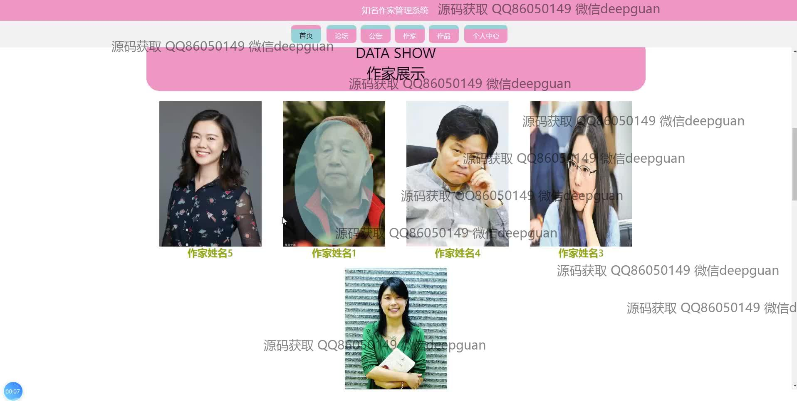
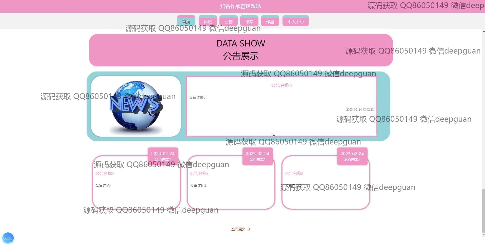
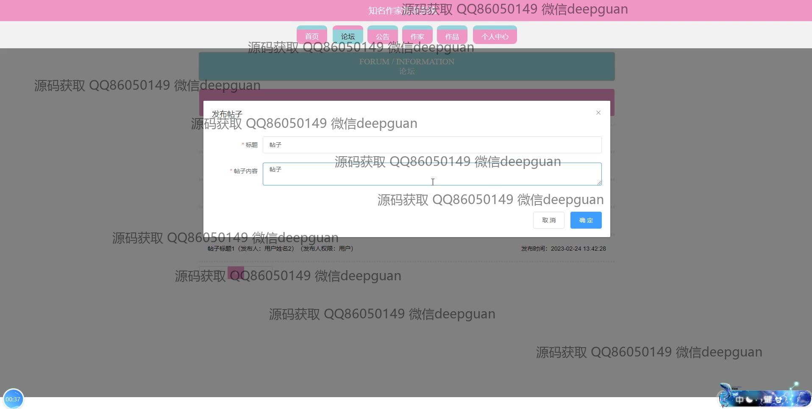
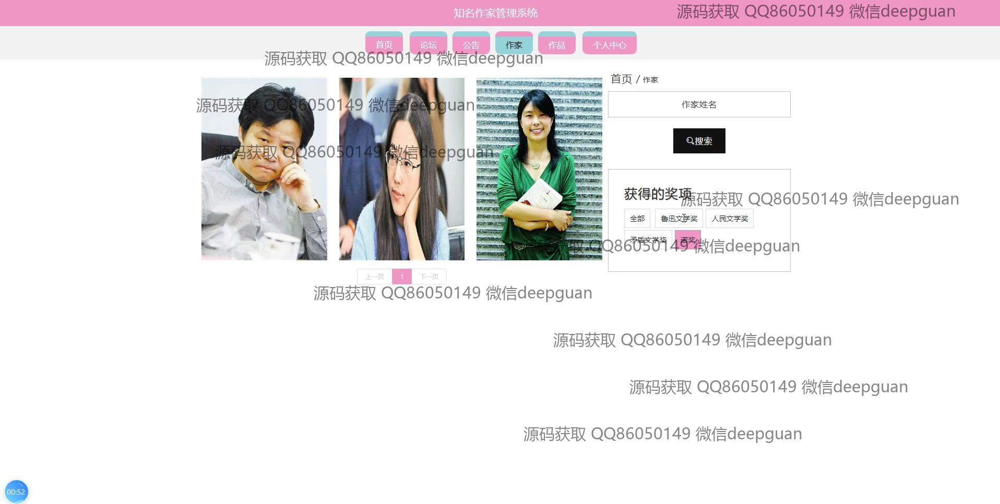
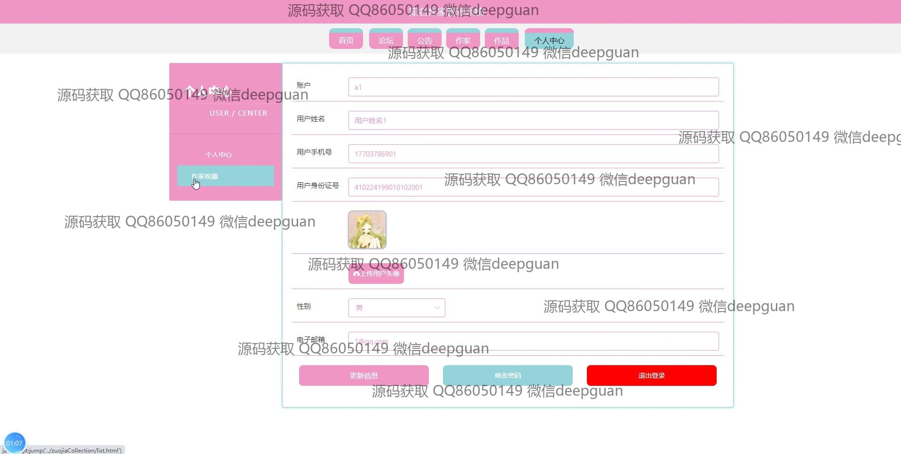
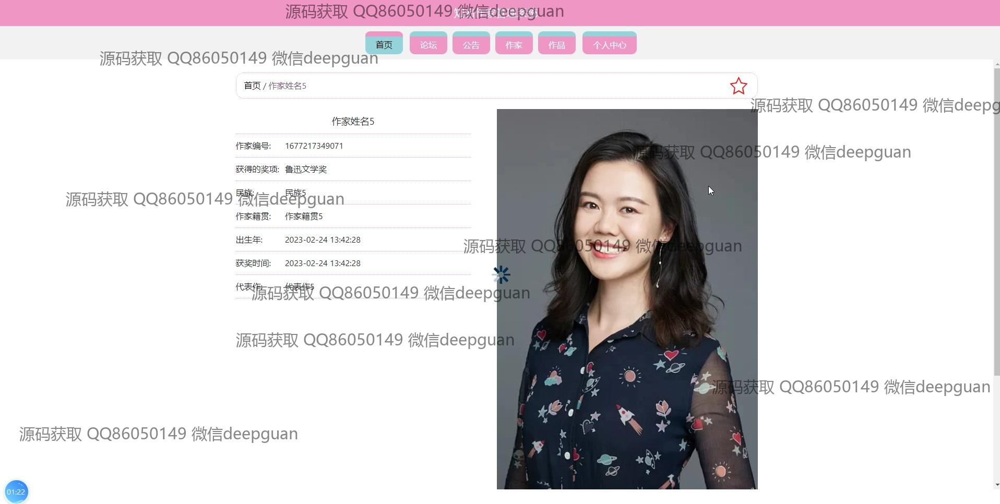
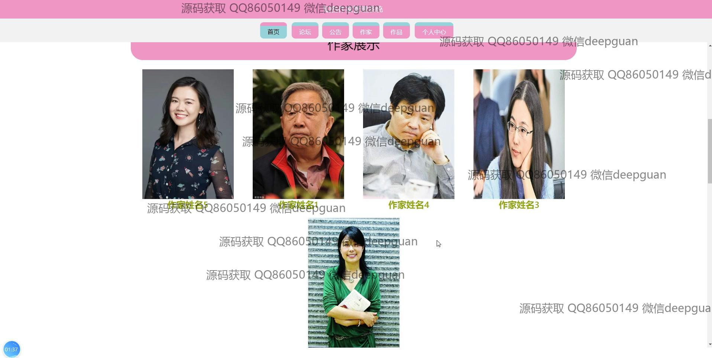
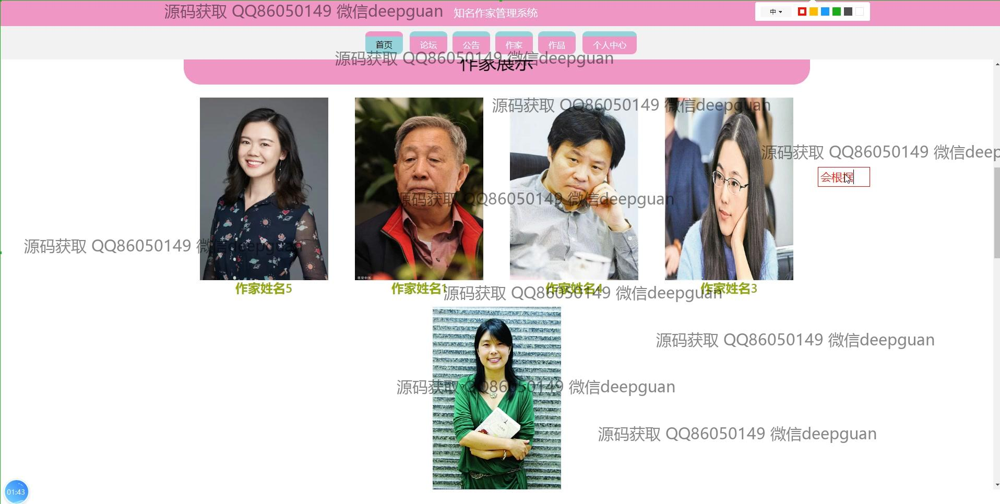
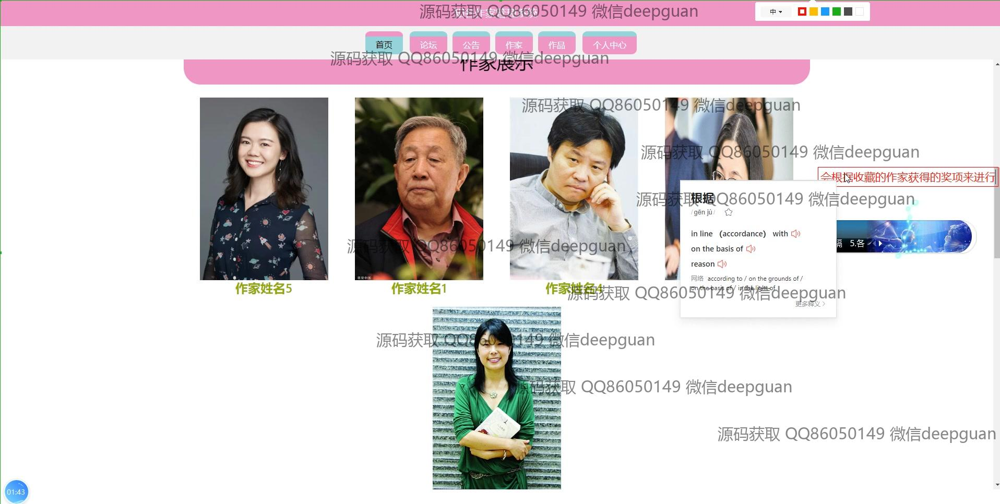
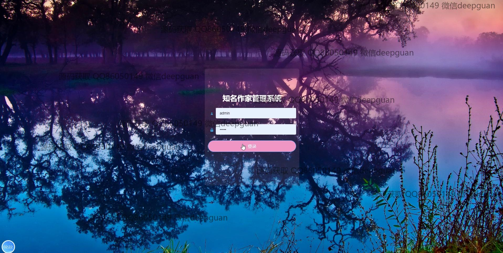
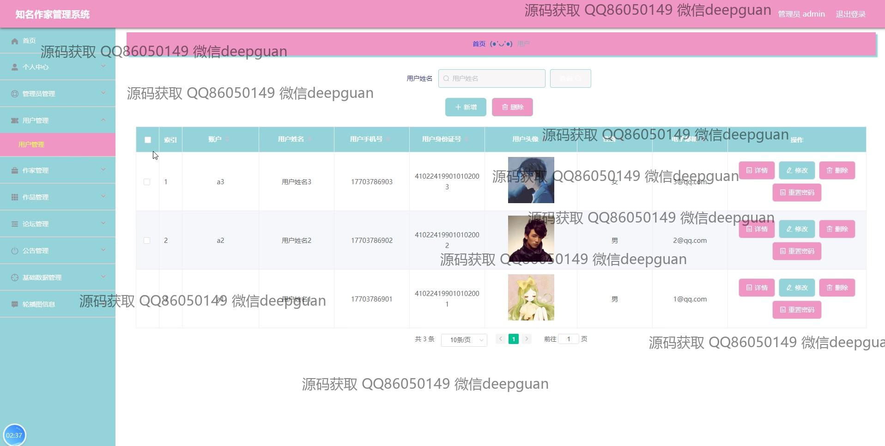
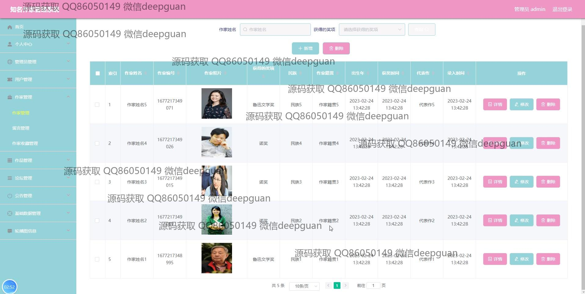
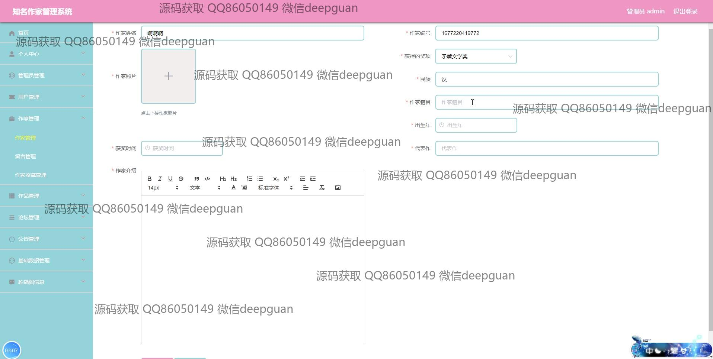
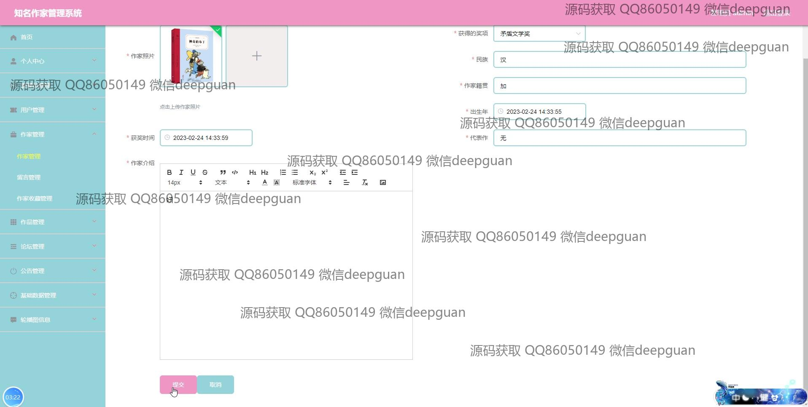
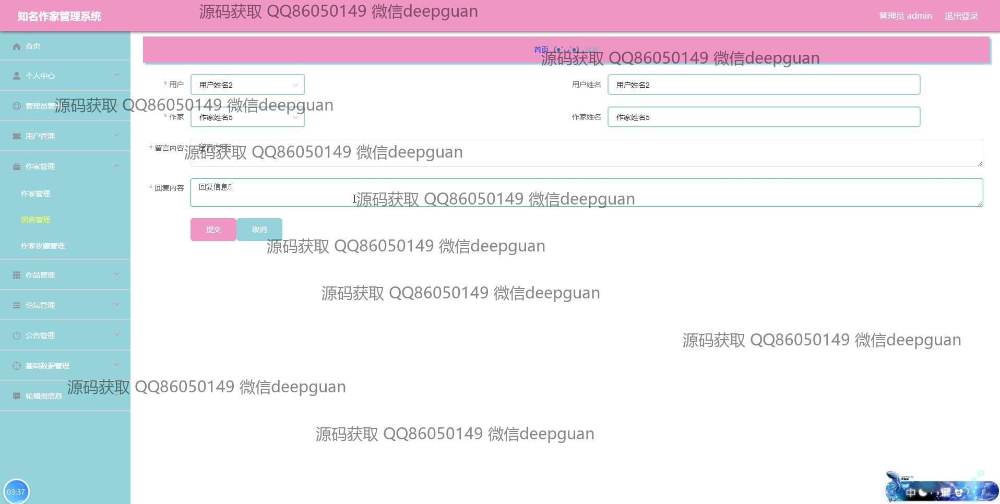
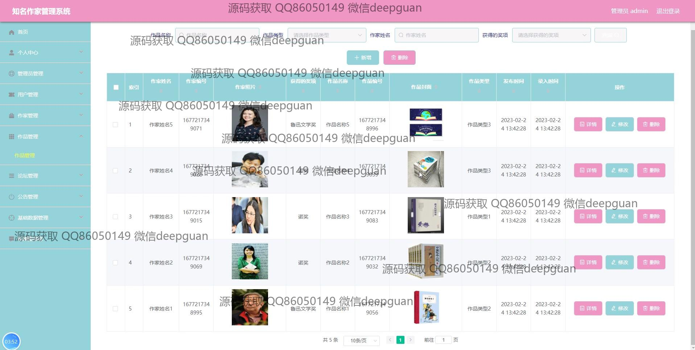
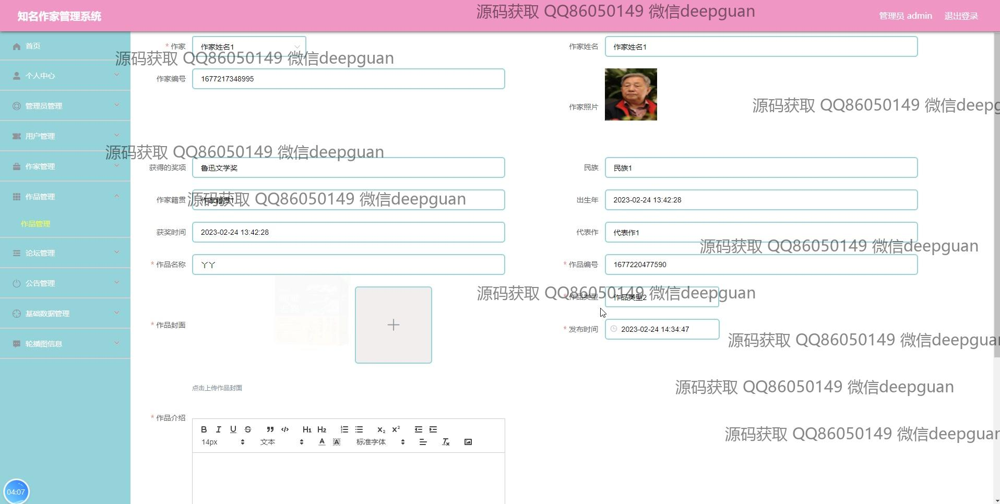
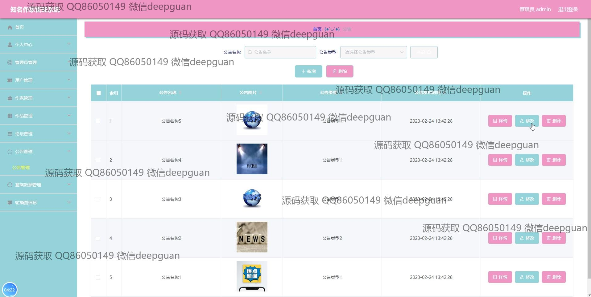
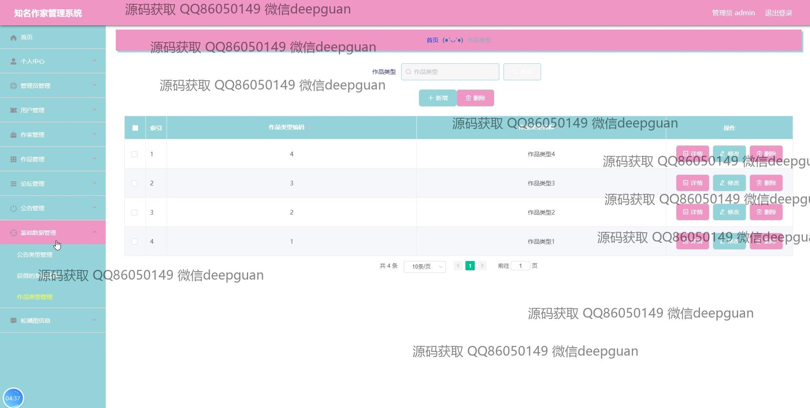

本代码来源于网络,仅供学习参考使用!

